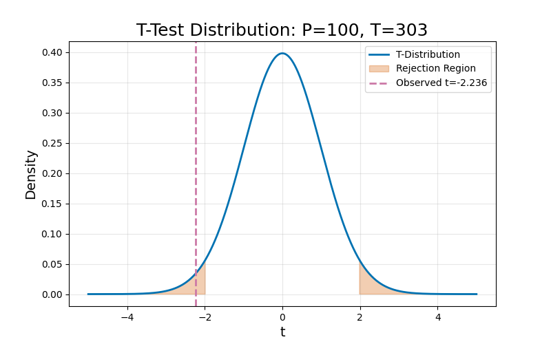
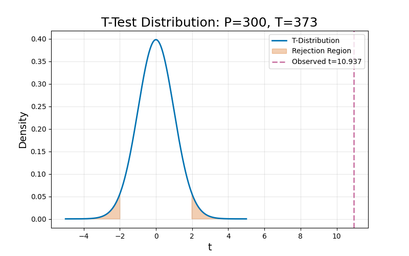

:::: {.columns}
::: {.column width="50%"}

## Sample slides
#### PlaceHolderName
#### Universiti Malaysia Perlis
#### [placeholder@email.com](mailto:placeholder@email.com)

<audio id="bg-music" src="media/audio/sb.m4a" loop></audio>

  Music: “Adrift” by Scott Buckley (CC BY 4.0)

:::

::: {.column width="50%"}

:::

::::

---

:::: {.columns}
::: {.column width="50%"}
### Slide one
**Key Concepts:**
- Energy conservation per @carnot1824.
- $\Delta U = Q - W$
:::

::: {.column width="50%"}

:::
::::

---

---

:::: {.columns}
::: {.column width="50%"}
### The Master Equation
The fundamental relation of thermodynamics:

$$\Delta U = Q - W$$

The work done $W$ is positive when the system expands against an external pressure.
:::

::: {.column width="50%"}
<video data-src="media/videos/sample.mp4" data-autoplay loop muted width="100%"></video>
:::

::::

---

:::: {.columns}
::: {.column width="50%"}
### Visualizing the Gas Law
**Interactive Model:**

- P, V, and T relationships.
- Use the slider to adjust pressure.
- Observe the phase boundary.
:::

::: {.column width="50%"}
<iframe 
  data-src="media/plots/sample.html" 
  width="100%" 
  height="500px" 
  style="border:none;" 
  scrolling="no">
</iframe>
:::
::::

---

# Bibliography

---

:::: {.columns}
::: {.column width="50%"}
### Math Score Distribution

This histogram visualizes the distribution of 'Math' scores within the dataset. It helps us understand the frequency of different score ranges among the students.
:::

::: {.column width="50%"}
<iframe 
  data-src="media/plots/math_score_histogram.html" 
  width="100%" 
  height="500px" 
  style="border:none;" 
  scrolling="no">
</iframe>
:::
::::

---

:::: {.columns}
::: {.column width="50%"}
### Interactive Math Score Distribution

This histogram visualizes the distribution of 'Math' scores within the dataset, allowing for interactive exploration of the data. You can hover over bars to see precise counts and zoom in on specific ranges.
:::

::: {.column width="50%"}
<iframe
  data-src='media/plots/math_scores_histogram_interactive.html'
  width='100%'
  height='500px'
  style='border:none;'
  scrolling='no'>
</iframe>
:::
::::

---

# MACHINE 1 SECTION

:::: {.columns}
::: {.column width="50%"}
### Control Chart: Machine 1
**Conditions:**
- Pressure: 200kPa
- Temp: 338K

Monitoring individual part measurements against statistical control limits.
:::

::: {.column width="50%"}
<iframe data-src='media/plots/control_m1.html' width='100%' height='500px' style='border:none;'></iframe>
:::
::::

---

:::: {.columns}
::: {.column width="50%"}
### Capability Assessment: Machine 1
**Parameters:**
- LSL: 48.0
- USL: 52.0

The histogram shows the distribution of parts relative to the design specifications.
:::

::: {.column width="50%"}
<iframe data-src='media/plots/capability_m1.html' width='100%' height='500px' style='border:none;'></iframe>
:::
::::

---

### Machine 1 Summary

**Cpk Calculation:**
$$\text{Cpk} = \min\left( \frac{USL - \mu}{3\sigma}, \frac{\mu - LSL}{3\sigma} \right)$$

**Status:**
Machines with $Cpk \ge 1.33$ are considered capable. Check generated logs for specific values based on the dataset.

---

# MACHINE 2 SECTION

:::: {.columns}
::: {.column width="50%"}
### Control Chart: Machine 2
**Conditions:**
- Pressure: 200kPa
- Temp: 338K

Monitoring individual part measurements against statistical control limits.
:::

::: {.column width="50%"}
<iframe data-src='media/plots/control_m2.html' width='100%' height='500px' style='border:none;'></iframe>
:::
::::

---

:::: {.columns}
::: {.column width="50%"}
### Capability Assessment: Machine 2
**Parameters:**
- LSL: 48.0
- USL: 52.0

The histogram shows the distribution of parts relative to the design specifications.
:::

::: {.column width="50%"}
<iframe data-src='media/plots/capability_m2.html' width='100%' height='500px' style='border:none;'></iframe>
:::
::::

---

### Machine 2 Summary

**Cpk Calculation:**
$$\text{Cpk} = \min\left( \frac{USL - \mu}{3\sigma}, \frac{\mu - LSL}{3\sigma} \right)$$

**Status:**
Machines with $Cpk \ge 1.33$ are considered capable. Check generated logs for specific values based on the dataset.

---

# MACHINE 3 SECTION

:::: {.columns}
::: {.column width="50%"}
### Control Chart: Machine 3
**Conditions:**
- Pressure: 200kPa
- Temp: 338K

Monitoring individual part measurements against statistical control limits.
:::

::: {.column width="50%"}
<iframe data-src='media/plots/control_m3.html' width='100%' height='500px' style='border:none;'></iframe>
:::
::::

---

:::: {.columns}
::: {.column width="50%"}
### Capability Assessment: Machine 3
**Parameters:**
- LSL: 48.0
- USL: 52.0

The histogram shows the distribution of parts relative to the design specifications.
:::

::: {.column width="50%"}
<iframe data-src='media/plots/capability_m3.html' width='100%' height='500px' style='border:none;'></iframe>
:::
::::

---

### Machine 3 Summary

**Cpk Calculation:**
$$\text{Cpk} = \min\left( \frac{USL - \mu}{3\sigma}, \frac{\mu - LSL}{3\sigma} \right)$$

**Status:**
Machines with $Cpk \ge 1.33$ are considered capable. Check generated logs for specific values based on the dataset.

---

### Slide 13: Statistical Distribution (Condition 1)

:::: {.columns}
::: {.column width="50%"}
**Comparison:** Machine 1 vs Machine 2
**Condition:** P=100kPa, T=303K

The plot visualizes the observed t-statistic relative to the critical rejection regions ($\alpha = 0.05$).
:::

::: {.column width="50%"}

:::
::::

---

### Slide 14: T-Test Results (Condition 1)

- **T-Statistic:** -2.2359
- **P-Value:** 2.7624e-02
- **Degrees of Freedom:** 98

---

### Slide 15: Decision Assessment (Condition 1)

**Question:** Is there a true difference at P=100, T=303?

**Conclusion:** Yes

*(Based on significance level $\alpha = 0.05$)*

---

### Slide 16: Statistical Distribution (Condition 2)

:::: {.columns}
::: {.column width="50%"}
**Comparison:** Machine 1 vs Machine 2
**Condition:** P=300kPa, T=373K

The plot visualizes the observed t-statistic relative to the critical rejection regions ($\alpha = 0.05$).
:::

::: {.column width="50%"}

:::
::::

---

### Slide 17: T-Test Results (Condition 2)

- **T-Statistic:** 10.9374
- **P-Value:** 1.1322e-18
- **Degrees of Freedom:** 98

---

### Slide 18: Decision Assessment (Condition 2)

**Question:** Is there a true difference at P=300, T=373?

**Conclusion:** Yes

*(Based on significance level $\alpha = 0.05$)*

---
# Bibliography

